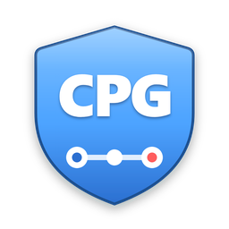
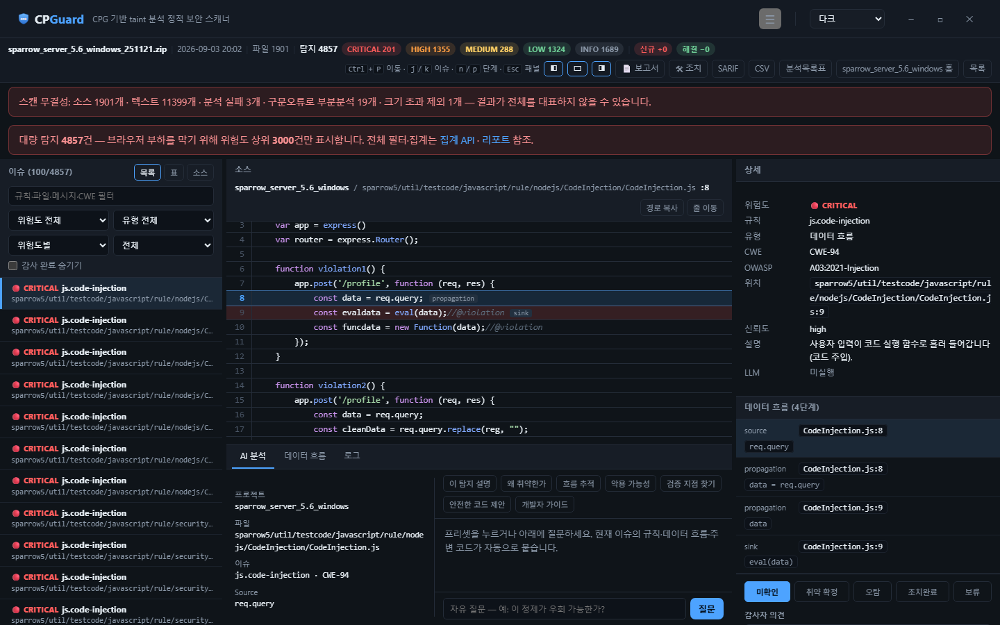
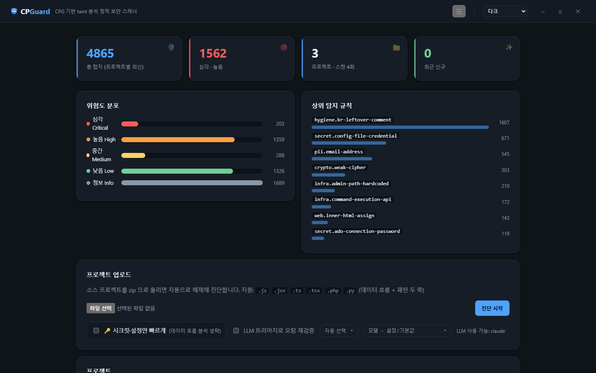
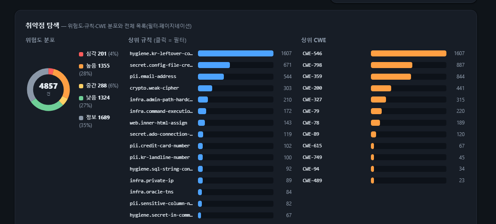
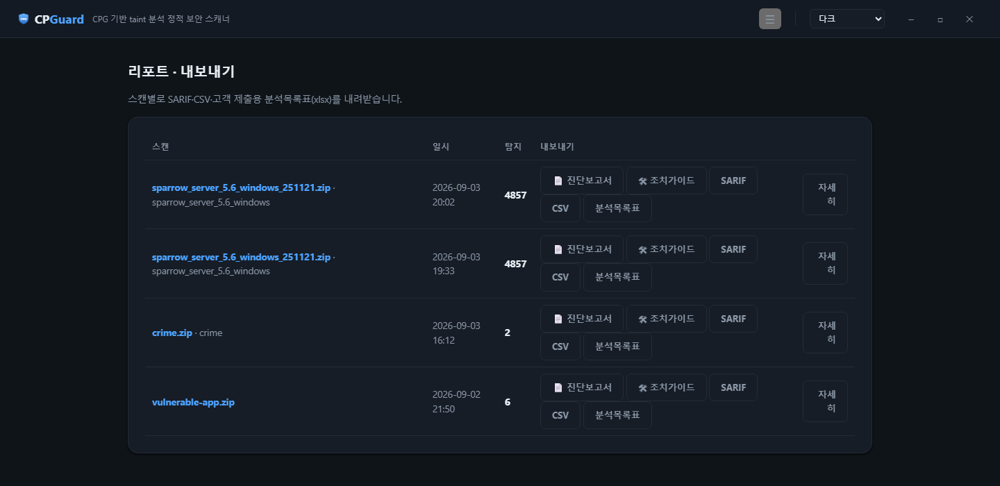

<p align="center">
  
</p>
<h1 align="center">CPGuard</h1>

<p align="center">
  <b>망분리 환경에서 소스코드부터 진단 산출물까지 한 번에</b><br/>
  <sub>CPG 기반 Taint 분석 · LLM 트리아지 · 진단결과보고서와 분석목록표 자동 생성 — 외부로 아무것도 내보내지 않는 데스크톱 도구</sub>
</p>

<p align="center">
  <a href="README.md">English</a> · <b>한국어</b>
</p>

<p align="center">
  
  
  
  
  
  
  
  
  
</p>

<p align="center">
  
</p>

> **CPGuard** = **CPG**(Code Property Graph, 코드 속성 그래프) + **Guard** — 패턴 목록이 아니라 코드 속성 그래프로 코드를 지킨다. 로고가 3개의 연결된 노드인 이유도 이 그래프다.

패턴 매칭 중심 도구의 오탐 한계를 넘기 위해 —
**tree-sitter 파싱 → 언어중립 IR → CPG(AST·CFG·def-use·call) → 프로시저간 taint(함수 요약) → LLM 트리아지**
로 정밀 탐지하고, 3분할 검토 화면에서 사람이 최종 판정한다.

<p align="center">
  
  <br/>
  <sub>취약점 검토 — 코드 뷰어 위에 <b>Source→Sink</b> taint 흐름을 강조하고, 인스펙터에서 규칙·CWE·흐름 단계·판정을 한눈에.</sub>
</p>

---

## ✨ 주요 기능

**탐지 두 축**
- **데이터 흐름(taint)** — **11개 언어**: JavaScript · TypeScript · PHP · Python · Java · Kotlin · Go · Ruby · C/C++ · Swift · C# (확장자 27종, **규칙 78개**).
  SQL 주입(CWE-89) · 명령 주입(78) · 코드 주입(94) · XSS(79) · 경로 조작(22) · 파일 포함(98) · SSRF(918) · 오픈 리다이렉트(601) · 안전하지 않은 역직렬화(502) · 버퍼 오버플로(120) · 포맷 스트링(134) · LDAP(90)/XPath(643) 주입 · WebView XSS · Intent 리다이렉션(926) · 라이브러리 주입(114).
- **패턴(단일 지점)** — 전 언어. 하드코딩 비밀정보·벤더키(798) · 개인정보(PII) · TLS 검증 비활성(295) · 취약 해시/암호(327) · 예측 가능 난수(338) · 쿠키 플래그(1004) · 디버그 코드.

**취약점 검토 화면**
- 3분할: 좌 이슈 탐색기(목록·표·소스 트리) / 중앙 코드 뷰어 / 우 인스펙터.
- 문법 하이라이팅 · 커맨드 팔레트(`Ctrl+P`) · 우클릭 컨텍스트 메뉴 · 여백 마커.
- **데이터 흐름 시각화** — Source→Sink 단계 그래프와 코드 뷰어가 동기화된다.
- **AI 분석 패널** — 선택한 이슈의 규칙·흐름·주변 코드를 자동으로 붙여 질의.
- 판정(취약 확정 / 오탐 / 조치완료 / 보류)과 감사자 의견, 판정별 행 색상, 감사 상태 필터, 스캔 간 신규/해결 비교.
- **판정하면 숫자가 그 자리에서 줍니다** — 오탐·보류·조치완료로 내리면 조치대상 건수와 위험도 배지가 즉시 반영됩니다. 탐지 총계는 스캔이 찾은 사실이라 그대로 둡니다.
- **재진단이 지난 판정을 이어받습니다** — 지문(규칙+파일+정규화한 위험지점 코드)이 같으면 감사 상태와 의견을 그대로 가져옵니다. 2·3차 진단에서 지난번 오탐을 다시 판정하지 않습니다.
- **필터로 좁힌 결과를 한 번에 판정** — 같은 위험지점에서 수십 건이 함께 나오는 게 정상이고, 하나씩 누르는 건 실무가 아닙니다.
- **흐름 내용으로 거르기** — 추적 경로 안의 호출·변수를 조건으로 겁니다(전체 흐름 / source / sink, 포함·미포함, 정규식 가능). `sanitize` 를 거친 흐름만 골라 한 번에 오탐 처리하는 식입니다.
- **불확실한 흐름 표시** — 분석 대상에 코드가 없는 함수를 거친 흐름은 표시하고 따로 걸러 볼 수 있습니다. 오탐 검토를 어디부터 할지 정해 줍니다.
- 유사 이슈 그룹(같은 규칙+같은 위험지점) · 판정 이력(무엇에서 무엇으로, 언제) · 판정 후 다음 이슈로 이동.

**진단 운영**
- **진단 중단** — 잘못 시작한 진단·배치를 멈춥니다. 진행 중인 항목은 멈추고 대기 항목은 시작하지 않습니다.
- **진행 중 진단으로 돌아가기** — 다른 화면을 보고 있어도 상단 띠에서 한 번에 돌아옵니다.
- **스캔 이력 다건 삭제** — 배치를 잘못 돌려 수백 건이 쌓였을 때 골라서 정리합니다.
- **프로젝트별 제외 설정** — 제외 경로(glob)·제외 규칙·제외 사유를 저장해 두면 다음 진단부터 적용되고, 파일을 아예 파싱하지 않습니다. 적용 내역은 스캔에 기록돼 보고서가 그 진단이 실제로 쓴 설정을 싣습니다.

**규모: 담당자 1명, 프로젝트 수백 개**
- **다건 업로드** — zip 여러 개를 한 번에 선택하거나, 프로젝트 zip 들을 담은 zip 하나를 올리면 각각 프로젝트가 된다.
- **배치 진행** — FIFO 워커가 프로젝트를 순차 진단하고 프로젝트별 상태를 보여준다.
- **프로젝트 포트폴리오** (`/projects/`) — 전 프로젝트의 최신 스캔을 한 표에서 검색·정렬·필터.
- **대량 산출물 배부** — 프로젝트를 골라 각 프로젝트의 PDF 보고서와 xlsx 를 담은 ZIP 하나로 내려받아 개발자에게 전달.

**발주처가 요구하는 기준으로 판정**
- 진단 시작 전에 기준을 체크합니다: **행정안전부 소프트웨어 개발보안 가이드** 보안약점 · **전자금융감독규정** 웹 취약점 점검항목 · **모바일 대응 보안약점**(초안) · **OWASP Top 10 (2021)** · **CWE**. 복수 선택이 가능합니다 — 실제 국내 산출물도 행안부와 전자금융감독규정을 함께 싣습니다.
- 연결 고리가 CWE 라 **스캔은 한 번, 기준은 보고 방식만 바꿉니다** — 기준을 바꾸거나 추가하려고 다시 스캔할 일이 없습니다.
- 취약점 검토 화면에서 점검항목으로 필터·그룹핑하고, **산출물 내보내기 패널에서 어떤 기준으로 뽑을지 다시 고를 수 있습니다**. 보고서의 *진단 항목* 절이 고른 기준들의 점검표 전체(항목별 판정)로 바뀌고, xlsx 에는 *점검항목 결과* 시트가 추가됩니다. 항목은 실제 진단 산출물과 같이 **유형·보안약점명**으로 적습니다 — 판마다 달라지는 항목 번호는 싣지 않습니다. 걸리지 않은 항목도 '양호'로 표에 남습니다 — 그게 무엇을 점검했는지에 대한 증빙입니다.
- **규칙이 없는 항목은 절대 '양호'로 찍지 않습니다.** 디렉터리 인덱싱·관리자 페이지 노출·CSRF 처럼 정적 분석 대상이 아닌 항목은 **'진단 대상 아님'** 으로 표기합니다 — 하지 않은 점검을 했다고 쓰지 않기 위해서입니다.
- 선택한 기준에 매핑되지 않는 탐지는 숨기지 않고 따로 보고합니다.

**그대로 제출할 수 있는 산출물**
- **보고서 양식** — 어떤 절을 실을지(상세 결과 · 소스/흐름 · 진단원 의견 · 제외 정보 · 분석 기준 · 분석 대상 현황), 표지 제목·머리말·로고를 이름 붙여 저장하고 내보낼 때 고릅니다. 발주처마다 양식이 다르고 사업별로 쌓이기 때문입니다.
- **제외 정보 · 분석 기준 · 분석 대상 현황** 부록 — 무엇을 왜 뺐는지, 어떤 규칙을 적용했는지(검출 0건 포함), 언어별 파일·라인·탐지·밀도. 점검표 성격의 산출물에서는 "점검했는데 안 나왔다"가 "나왔다"만큼 중요합니다.
- **합본 진단 결과 보고서** — 리포트 화면에서 포함할 프로젝트를 체크하면, 여러 프로젝트를 한 건의 진단으로 묶은 제출용 문서가 나옵니다. 진단 목적·근거 고시·수행 일정·점검 도구·수행 인원, 기준별 진단 항목, **최초 검출 → 정오탐 점검 → 최종 조치대상**, 프로젝트별 상세(파일 수·빌드 라인·개발언어·보안약점별 위험도), 유형별 조치 권고, 부록까지. 국내 진단업체가 실제로 내는 산출물 구성을 따랐습니다.
- **검토 판정이 곧 보고서가 됩니다.** 검토 화면에서 오탐·제외로 판정하고 그 사유를 적는 일이, 스캐너 출력을 산출물로 바꾸는 과정입니다. 3.2 절이 그 판정으로 만들어지고 최초/최종 건수가 그만큼 달라집니다.
- **Word(.docx) 와 PDF.** Word 본이 편집 원본이라 발주처 문서 양식에 얹고, 현장에서 확인한 의견을 더해 최종본으로 만들 수 있습니다. 절·표·문안은 PDF 와 동일합니다.
- **분석목록표(xlsx)** — 국내 발주처가 요구하는 14컬럼 고정 형식에 *점검항목 결과* 시트를 더합니다.
- 산출물은 전부 **검은 글자 + 옅은 회색**입니다. 진단 보고서는 흑백 출력·복사본으로 돌아다니고 발주처 양식에 그대로 얹히므로, 색으로만 구분되는 정보를 두지 않았습니다 — 위험도는 명도로, 판정은 글자로 읽힙니다.

**LLM 트리아지**
- Claude · ChatGPT(OpenAI) · Gemini. 도달 가능성 재검증과 설명, 프로바이더·모델 선택 가능. Gemini 무료 티어로 바로 시험해 볼 수 있다.

**산출물**
- **진단 결과 보고서(PDF)** — 표지 · 문서 개정 이력 · 목차 · 대상 범위/진단 방법 · 위험도 차트 · 진단 항목 · 취약점별 상세 카드(대상 · 설명 · 데이터 흐름 단계 · 영향 · 조치 방안 · 안전 예시 · CWE 참고) · 종합 의견 · 위험도 판정 기준 부록 · 회차별 진단 이력 표.
- 조치 가이드(PDF) · SARIF 2.1.0 · CSV · 14컬럼 분석목록표(xlsx).
- 보고서 메타(작성자 · 수행 기관 · 발주처 · 담당자 · 기간 · 버전)는 설정 화면에서 입력한다.

**UX·배포**
- 플랫한 모던 IDE 디자인, 테마 4종(다크 / 라이트 / VS Code / Ghidra).
- **한국어 ⇄ English 토글** — UI 뿐 아니라 서버 생성물까지: 룰 메시지 · PDF 보고서 · xlsx · CSV · SARIF.
- **오프라인·클린 머신 설치** — 파이썬·인터넷·관리자 권한 없이 단일 exe(PyInstaller + Inno Setup).
- 네이티브 데스크톱 창(WebView2, 부재 시 브라우저 폴백) 또는 브라우저 대시보드.

---

## 🖥 화면

| 대시보드 | 취약점 탐색 (차트·필터·페이지네이션) |
|:---:|:---:|
|  |  |
| 상태 타일 · 위험도 분포 · 상위 규칙 | 위험도 도넛 · 상위 규칙/CWE 막대 · 대량 탐지 탐색기 |

<p align="center">
  
  <br/>
  <sub>리포트·내보내기 — 스캔별 진단 보고서·조치 가이드 PDF · SARIF · CSV · 분석목록표(xlsx)</sub>
</p>

> 취약점 검토 화면(코드 뷰어 + Source→Sink 흐름 + 인스펙터)은 위쪽 히어로 이미지 참조.

---

## 📦 다운로드 / 설치

### 설치본 — Windows (권장 · 파이썬 불필요)

[Releases](https://github.com/KimJeju/cpguard/releases) 에서 `CPGuard-Setup-0.1.3.exe` 를 받아 실행합니다.
사용자 영역 설치라 관리자 권한이 필요 없고, WebView2 런타임이 없으면 자동 설치합니다.

직접 빌드하려면:

```powershell
powershell -ExecutionPolicy Bypass -File packaging/build.ps1
```

무설치 이동식으로도 쓸 수 있습니다 — `dist/CPGuard` 폴더를 통째로 복사해 `CPGuard.exe` 실행.

### 소스에서 — Windows · macOS · Linux

```bash
pip install .
cpguard --help
```

분석 엔진·웹 UI·모든 산출물 포맷은 순수 파이썬이라 세 플랫폼에서 동일하게 동작합니다.
설치본과 네이티브 데스크톱 창(WebView2)만 Windows 전용입니다. PDF 보고서의 한글 출력에는
한글 폰트가 필요한데, Windows·macOS 는 기본 탑재이고 Linux 는 `fonts-nanum` 을 설치하거나
`CPGUARD_PDF_FONT` 환경변수로 원하는 TrueType 폰트를 지정하면 됩니다.

## 🚀 사용법

```bash
# CLI 스캔 (SARIF·분석목록표 산출)
cpguard scan ./project --sarif out.sarif --xlsx out.xlsx

# 점검 기준 적용 (mois | efs | owasp | cwe · 복수 지정 가능)
cpguard scan ./project --standard mois --standard efs --xlsx out.xlsx

# LLM 트리아지로 오탐 재검증
cpguard scan ./project --triage --provider gemini

# 웹 대시보드 (브라우저)
cpguard serve

# 네이티브 데스크톱 창
cpguard app
```

대시보드에서: zip 업로드 → 진행 화면(단계 체크리스트·구동 로그) → 검토·판정 →
⚙️ 설정에 LLM 키를 넣으면 AI 분석·트리아지가 활성화됩니다.

## 🔁 CI/CD (GitHub Actions)

PR·푸시마다 자동 스캔 → SARIF 를 **GitHub Code Scanning** 에 올려 신규 취약점을 코드/PR 에
인라인 표시. 등급 게이트로 빌드 실패도 가능.

```yaml
# .github/workflows/cpguard.yml
permissions:
  contents: read
  security-events: write
jobs:
  scan:
    runs-on: ubuntu-latest
    steps:
      - uses: actions/checkout@v4
      - id: cpguard
        uses: KimJeju/cpguard@v0.1.3
        with:
          path: '.'
          fail-on: 'high'      # high 이상 탐지 시 빌드 실패 (none=게이트 안 함)
      - if: always()
        uses: github/codeql-action/upload-sarif@v3
        with: { sarif_file: '${{ steps.cpguard.outputs.sarif }}' }
```

CLI 로도 게이트 가능: `cpguard scan . --sarif out.sarif --fail-on high`
(해당 등급 이상 탐지 시 종료코드 1). 이 저장소의 [`.github/workflows/cpguard.yml`](.github/workflows/cpguard.yml) 이 실동작 예시.

---

## 🧱 아키텍처

```
tree-sitter → 언어중립 IR → CPG(AST·CFG·def-use·call) → 프로시저간 taint(함수 요약)
                                                              ↘ LLM 트리아지 → 검토 화면 / 리포트
전 언어 패턴 축(비밀정보·PII·설정 점검) ──────────────────────↗
```

- **건전한 과대근사** — 분기 양쪽 병합, 요약 고정점(재귀·상호재귀), 미상 함수는 오염 통과.
- **무결성 보고** — "0건"이 안전인지 못 읽은 건지 구분(파싱 실패·크기 초과·구문오류 기록·표시).
- **읽기 전용·근거 수집** 기조: 도구가 조용히 취약점을 숨기지 않고, 최종 판정은 사람이.
- 언어 추가는 포크가 아니라 표 하나 — 정규화기가 각 문법의 노드를 공통 IR 로 옮기므로 CPG·taint 엔진은 그대로다.

스택: Python 3.11+ · tree-sitter(11개 언어) · Django(SSR) · reportlab(PDF) ·
openpyxl(xlsx) · SARIF 2.1.0 · LLM SDK(anthropic/openai/google-genai) · pytest.

## 📊 정확도

**라벨링된 정답지 8개 언어, 5개 코퍼스 138,785건** 기준 측정 결과입니다(그중 채점 대상 **76,866건**, 나머지는 아래 제외 기준에 해당).
점수 = 재현율 − 오탐률 (OWASP Benchmark 공식 지표, 무작위 추측 = 0.000).

| 코퍼스 | 언어 | 지표 대상 | 재현율 | 정밀도 | 점수 |
|---|---|---:|---:|---:|---:|
| OWASP Benchmark v1.2 | Java | 1,572 | 95.8% | 88.7% | **0.826** |
| OWASP Benchmark for Python | Python | 346 | 82.1% | 83.3% | **0.717** |
| BenchProctor (httplib / standalone) | C++ | 800 | ~79% | 100% | **0.79** |
| BenchProctor (gin / net_http) | Go | 2,000 | ~80% | ~85% | **0.66** |
| BenchProctor (standalone) | C | 500 | 52.0% | 100% | **0.520** |
| BenchProctor (express / koa) | JavaScript | 2,200 | ~66% | ~78% | **0.47** |
| BenchProctor (express_ts / nestjs) | TypeScript | 2,200 | ~62% | ~79% | **0.45** |
| BenchProctor (rails / sinatra) | Ruby | 2,400 | ~56% | ~81% | **0.43** |
| PHP Vulnerability test suite | PHP | 31,824 | 47.0% | 66.4% | **0.369** |
| C# Vulnerability Test Suite | C# | 33,024 | 30.5% | 87.8% | **0.245** |

그대로 읽으면 이렇습니다. **Java·C++·Python·Go 는 실무에 쓸 수준, C·JS/TS·Ruby 는
쓸 만한 수준, PHP·C# 은 아직 부족합니다.**

**DB·파일에서 읽은 값은 기본적으로 사용자 입력으로 봅니다** — 2차 주입과 저장형 XSS 가
여기서 나옵니다. `--trust-stored-data` 로 끌 수 있습니다. 이 기본값은 취향이 아니라
측정으로 정했습니다: 15개 스위트를 A/B 로 재니 손해 보는 곳이 하나도 없었고, Go 는
취약 50건을 더 잡으면서 오탐은 9건만 늘었습니다.

다만 **C·C++ 의 정밀도 100% 는 그대로 믿을 숫자가 아닙니다.** 표본이 400~500건으로
작고, 이 코퍼스의 안전 변형이 두 가지 관용구(`검사(x) ? x : 기본값`, `검사 실패 시
기본값 대체`)로만 만들어져 있습니다. 그 둘을 읽게 하자 오탐이 한 번에 0 이 됐습니다 —
실제 C 코드의 다양성을 잰 값이 아니라 이 코퍼스의 생성 규칙을 다 맞혔다는 뜻에
가깝습니다. 재현율 52~80% 쪽이 더 정직한 신호입니다. Kotlin·Swift 는 공개된 라벨 코퍼스가 아예 없어
관용구 테스트로 대신합니다(아래).

점수가 낮은 쪽은 대개 **오탐이 많아서가 아니라 재현율이 낮아서**입니다(C# 재현율 30.5%).

설정 점검 성격의 유형(`weakrand`·`crypto`·`hash`·`securecookie`·`trustbound`)은 데이터
흐름 문제가 아니므로 공짜 점수로 넣지 않고 제외합니다. 반대로 **흐름 분석 대상이지만
우리에게 규칙이 없는 유형**(NoSQL 주입·SSTI·프로토타입 오염·XXE 등)은 앞엣것과 **따로**
보고합니다 — 같이 묶어 빼면 커버리지를 부풀리게 됩니다.

**벤치마크가 실제 엔진 개선을 이끌었습니다.** Java 는 0.137, PHP 는 0.001 에서 시작했고
이후의 모든 상승은 수치가 드러낸 결함을 고친 결과입니다 — `try` 블록 안에서 오염이 끊기던
문제, for-each 반복 변수가 컬렉션의 오염을 잃던 문제, 경로 민감도 부재, 컨테이너 변경
미전파, 비교 연산 결과가 오염을 옮기던 문제, 생성자→필드→메서드 흐름이 **네 언어 전부에서**
미탐이던 문제, 리턴이 아니라 인자로 결과를 내주는 입력 API(`fgets(buf, …)`·`Decode(&v)`)
미모델링, **클로저를 빈 환경으로 실행해** 붙잡은 변수가 전부 깨끗해 보이던 문제, 그리고
가장 최근에는 검증이 오염값 자체가 아니라 그 **투영**에 걸릴 때(`if !allowed[url.Parse(x).Hostname()] { 거부 }`)
원본이 오염으로 남던 문제 — Go 오탐의 59% 가 이 하나였습니다.
각 수정은 테스트케이스에 맞춘 것이 아니라 일반적인 분석 기법입니다. 단계별 전후 기록은
[`bench/README.md`](bench/README.md) 에 있습니다.

**정답지가 없는 자리**(Kotlin·Swift, 그리고 코퍼스가 다루지 않는 프레임워크)는 **관용구
테스트**로 대신합니다. 실제 코드에서 흔한 형태 130건을 최소 재현으로 만들어 테스트 스위트에
넣었습니다. 이쪽은 벤치마크와 **다른 종류의 결함**을 잡습니다 — TypeScript 파라미터가 타입
표기를 이름에 달고 들어와 **타입을 쓴 모든 함수가 프로시저간 분석에서 빠져 있던** 결함이
그렇게 드러났고, 고쳤을 때 벤치마크 점수는 하나도 움직이지 않았습니다.

실제 앱(DVWA, PHP) 기준 보조 측정도 함께 공개합니다. 전체 방법론·유형별 표·한계는
[`bench/README.md`](bench/README.md) 참조.

## 📈 대규모 코드베이스

20~30GB 소스나 5만 건 이상 탐지 같은 극단 규모의 최적화 전략(싱크 사전 필터링,
증분·요약 캐시, Finding DB 테이블화, 집계·가상 스크롤, 트리아지 클러스터링 등)은
[`docs/large-scale.md`](docs/large-scale.md) 참조.

## 🗺️ 로드맵

- [x] taint 코어 · 패턴 엔진 · LLM 트리아지 · 취약점 검토 화면
- [x] PDF 진단 보고서·조치 가이드 · 오프라인 설치본
- [x] Finding DB 테이블화 + 서버측 페이지네이션 · 가상 스크롤(대량 탐지)
- [x] 싱크 사전 필터링 · 멀티프로세스 · 파싱/요약 캐시 · 트리아지 클러스터링
- [x] CI/CD 통합 — GitHub Action · SARIF → Code Scanning · 등급 게이트
- [x] 정확도 측정 8개 언어 — 라벨링 코퍼스 5종, 채점 76,866건 ([상세](bench/README.md))
- [x] 11개 언어 — Java · Kotlin · Go · Ruby · C/C++ · Swift · C# 추가
- [x] 다건 배치 진단 · 프로젝트 포트폴리오 · 대량 산출물 배부
- [x] 상수 전파 · 컨테이너 오염 전파 · 리터럴 키 단위 맵 추적
- [x] 재진단 판정 승계 · 벌크 판정 · 흐름 내용 필터 · 판정 이력
- [x] 프로젝트 제외 설정 · 보고서 양식 · 분석 대상 현황·제외 정보·분석 기준 부록
- [ ] 프레임워크 인지 진입점(Spring·JPA) · sanitizer 인식 강화

## 📄 라이선스

[Apache License 2.0](LICENSE). 상업적 이용을 포함해 자유롭게 사용·수정·재배포할 수 있으며,
저작권 고지와 라이선스 전문을 유지하면 됩니다. 명시적 특허 사용 허락 조항을 포함합니다.

동봉 서체: **나눔고딕** (c) NHN Corporation, [SIL Open Font License 1.1](cpguard/report/fonts/OFL.txt). 한글 폰트가 없는 서버에서도 한글 보고서가 나오도록 패키지에 포함합니다.
