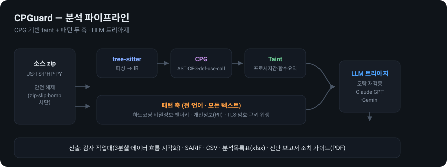

<h1 align="center">🛡️ CPGuard</h1>

<p align="center">
  <b>CPG 기반 Taint 분석 + LLM 트리아지</b>를 결합한 오픈소스 정적 보안 분석(SAST) 도구<br/>
  <sub>Fortify · MobSF · Semgrep · Ghidra 의 장점을 결합한 데스크톱 보안 분석 작업대</sub>
</p>

<p align="center">
  
  
  
  
  
  
</p>

<p align="center">
  
</p>

패턴 매칭 중심 상용 SAST의 오탐 한계를 넘기 위해 —
**tree-sitter 파싱 → 언어중립 IR → CPG(AST·CFG·def-use·call) → 프로시저간 taint(함수 요약) → LLM 트리아지**
로 정밀 탐지하고, Ghidra/Fortify 결의 3분할 감사 작업대에서 조사·판정·조치까지 연결한다.

---

## ✨ 주요 기능

**탐지 두 축**
- **데이터 흐름(taint)** — JS · TS · PHP · Python. SQL 주입(CWE-89) · 명령 주입(78) · 코드 주입(94) · XSS(79) · 경로 조작(22) · 파일 포함(98) · SSRF(918) · 오픈 리다이렉트(601)
- **패턴(단일 지점)** — 전 언어. 하드코딩 비밀정보·벤더키(798) · 개인정보(PII) · TLS 검증 비활성(295) · 취약 해시/암호(327) · 예측 가능 난수(338) · 쿠키 플래그(1004)

**감사 작업대 (Ghidra/IDE 결)**
- 3분할: 좌 이슈 탐색기(목록·표·소스 트리) / 중앙 코드 뷰어 / 우 인스펙터
- **문법 하이라이팅** · **커맨드 팔레트(Ctrl+P)** · **우클릭 컨텍스트 메뉴** · 여백 마커 툴팁
- **데이터 흐름 시각화** — Source→Sink 단계 그래프와 코드 뷰어 동기화
- **AI 분석 패널** — 현재 이슈의 규칙·흐름·주변 코드를 자동으로 붙여 질의
- 표 보기 · 감사 상태 · 스캔 간 신규/해결 비교 · 워크스페이스 영속

**LLM 트리아지**
- Claude · ChatGPT(OpenAI) · Gemini. 오탐 재검증·도달성 설명, 프로바이더·모델 선택.

**산출물**
- 진단 결과 보고서(PDF) · 유형별 조치 가이드(PDF) · SARIF 2.1.0 · CSV · 분석목록표(xlsx)

**UX·배포**
- 테마 4종(다크 / 라이트 / VS Code / Ghidra) · Apple HIG 결의 리퀴드 글래스 셸
- **오프라인·클린 머신 설치** — 파이썬·인터넷 없이 단일 exe(PyInstaller + Inno Setup)
- 네이티브 데스크톱 창(WebView2, 부재 시 브라우저 폴백) 또는 브라우저 대시보드

---

## 📦 다운로드 / 설치

### 설치본 (권장 · 파이썬 불필요)
`packaging/build.ps1` 로 만든 `CPGuard-Setup-0.1.0.exe` 를 실행합니다.
사용자 영역 설치라 관리자 권한이 필요 없고, WebView2 런타임이 없으면 자동 설치합니다.

```powershell
powershell -ExecutionPolicy Bypass -File packaging/build.ps1
```

무설치 이동식으로도 쓸 수 있습니다 — `dist/CPGuard` 폴더를 통째로 복사해 `CPGuard.exe` 실행.

### 소스에서 (개발)

```bash
pip install .
cpguard --help
```

## 🚀 사용법

```bash
# CLI 스캔 (SARIF·분석목록표 산출)
cpguard scan ./project --sarif out.sarif --xlsx out.xlsx

# LLM 트리아지로 오탐 재검증
cpguard scan ./project --triage --provider gemini

# 웹 대시보드 (브라우저)
cpguard serve

# 네이티브 데스크톱 창
cpguard app
```

대시보드에서: zip 업로드 → 진행 화면(단계 체크리스트·구동 로그) → 작업대에서 조사·판정 →
⚙️ 설정에 LLM 키 입력 시 AI 분석·트리아지 활성화. Gemini 는 무료 티어로 사용 가능.

## 🔁 CI/CD (GitHub Actions)

PR·푸시마다 자동 스캔 → SARIF 를 **GitHub Code Scanning** 에 올려 신규 취약점을 코드/PR 에
인라인 표시. 등급 게이트로 빌드 실패도 가능.

```yaml
# .github/workflows/cpguard.yml
permissions:
  contents: read
  security-events: write
jobs:
  sast:
    runs-on: ubuntu-latest
    steps:
      - uses: actions/checkout@v4
      - id: cpguard
        uses: KimJeju/cpguard@main
        with:
          path: '.'
          fail-on: 'high'      # high 이상 탐지 시 빌드 실패 (none=게이트 안 함)
      - if: always()
        uses: github/codeql-action/upload-sarif@v3
        with: { sarif_file: '${{ steps.cpguard.outputs.sarif }}' }
```

CLI 로도 게이트 가능: `cpguard scan . --sarif out.sarif --fail-on high`
(해당 등급 이상 탐지 시 종료코드 1). 이 저장소의 [`.github/workflows/cpguard.yml`](.github/workflows/cpguard.yml) 이 실동작 예시.

---

## 🧱 아키텍처

```
tree-sitter → 언어중립 IR → CPG(AST·CFG·def-use·call) → 프로시저간 taint(함수 요약)
                                                              ↘ LLM 트리아지 → 감사 작업대 / 리포트
전 언어 패턴 축(비밀정보·PII·설정 위생) ──────────────────────↗
```

- **건전한 과대근사** — 분기 양쪽 병합, 요약 고정점(재귀·상호재귀), 미상 함수는 오염 통과.
- **무결성 보고** — "0건"이 안전인지 못 읽은 건지 구분(파싱 실패·크기 초과·구문오류 기록).
- **읽기 전용·근거 수집** 기조: 도구가 조용히 취약점을 숨기지 않고, 최종 판정은 사람이.

스택: Python 3.11+ · tree-sitter(js/ts/php/python) · Django(SSR) · reportlab(PDF) ·
openpyxl(xlsx) · SARIF 2.1.0 · LLM SDK(anthropic/openai/google-genai) · pytest.

## 📈 대규모 코드베이스

20~30GB 소스나 5만 건 이상 탐지 같은 극단 규모의 최적화 전략(싱크 사전 필터링,
증분·요약 캐시, Finding DB 테이블화, 집계·가상 스크롤, 트리아지 클러스터링 등)은
[`docs/large-scale.md`](docs/large-scale.md) 참조.

## 🗺️ 로드맵

- [x] JS/TS/PHP/Python taint 코어 · 패턴 엔진 · LLM 트리아지 · 감사 작업대
- [x] PDF 진단 보고서·조치 가이드 · 오프라인 설치본
- [x] Finding DB 테이블화 + 서버측 페이지네이션 · 가상 스크롤(대량 탐지)
- [x] 싱크 사전 필터링 · 멀티프로세스 · 파싱/요약 캐시 · 트리아지 클러스터링
- [x] CI/CD 통합 — GitHub Action · SARIF → Code Scanning · 등급 게이트
- [ ] Java 어댑터
- [ ] 정확도 벤치마크 공개(OWASP Benchmark)

## 📄 라이선스

교육·연구용 오픈소스 프로젝트(졸업작품). 별도 라이선스 파일을 추가할 예정입니다.
